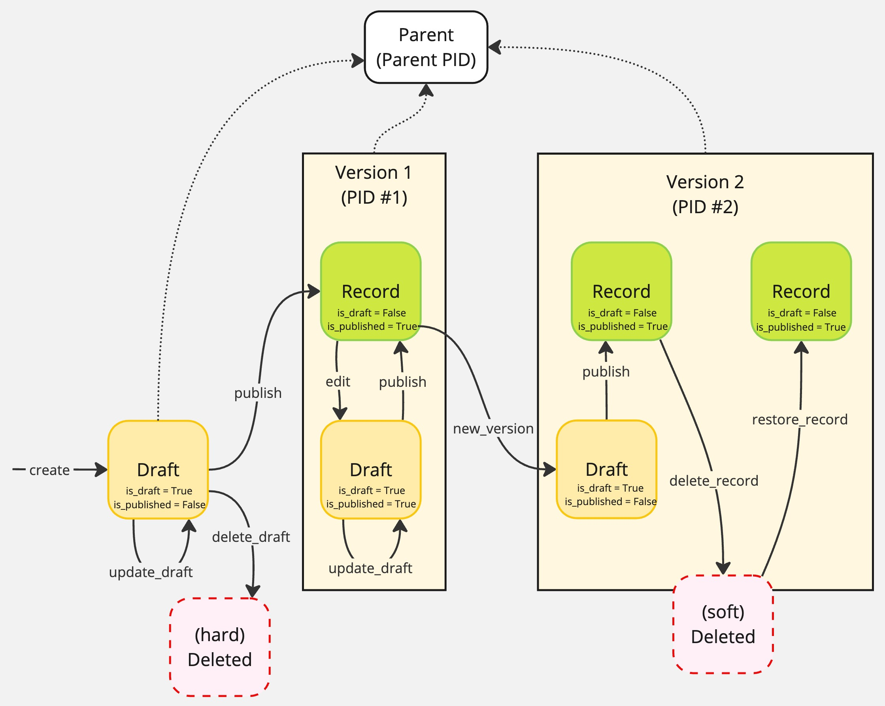

# KCWorks Architecture

## InvenioRDM's Layered Architecture

InvenioRDM employs a layered architecture with:

1. Data layer
    - Low-level data storage and retrieval.
        - Primarily SQLAlchemy model classes.
    - High-level data API classes that provide a Pythonic interface to the data layer.
        - Validate data before storing it.
2. Service layer
    - Retrieves and modifies data from the data layer, either for a view or for another service.
        - Providing abstract CRUD methods for operating on the data layer's API classes.
        - Providing abstracted "result items" and "result lists"
    - Enforces permission and access control policies.
3. View layer
    - Consists of
        - Flask views (registered as Blueprints)
        - rendering either
            - Jinja2 templates to produce HTML
            - JSON to produce API responses
        - in some cases, React components embedded in the Jinja2 templates
            - These are rendered on the client side
            - Data is passed from the Jinja2 templates to the React components via HTML data attributes

## InvenioRDM Services

An InvenioRDM service is a class that provides methods for interacting with the data layer. The business logic of the service is usually delegated to one or more component classes, which are called during the service's methods.

### Service Classes

#### BaseService

The base Service class is defined in `invenio_records_resources.services.base.Service`. It defines methods for:

- Getting the service ID
    - `id(self)`: Return the id of the service from config.
- Permissions checking
    - `permission_policy(self, action_name, **kwargs)`: Factory for a permission policy instance.
    - `check_permission(self, identity, action_name, **kwargs)`: Check a permission against the identity.
    - `require_permission(self, identity, action_name, **kwargs)`: Require a specific permission from the permission policy.
- Handling service components
    - `components(self)`: Return initialized instances of the service's component classes.
    - `run_components(self, action, *args, **kwargs)`: Run components for a given action.
- Producing result items and lists
    - `result_item(self, *args, **kwargs)`: Create a new instance of the resource unit, i.e. whatever the service provides.
    - `result_list(self, *args, **kwargs)`: Create a new list of resource units. In some cases this is a simple iterable of resource units, but in other cases it is a more complex object that includes additional data.

#### RecordService

Services dealing with InvenioRDM records of some kind (e.g. records, drafts, communities, etc.) inherit from the `RecordService` class defined in `invenio_records_resources.services.records.service`. This class adds:

- properties and methods related to the service's related data-layer API class
    - A `schema` property that returns a `ServiceSchemaWrapper` instance.
    - A `record_cls` property that returns the record class for the service.
    - A `links_item_tpl` property that returns a `LinksTemplate` instance for constructing links to a resource unit.
    - An `expandable_fields` property that returns a list of expandable fields for the service's data-layer API class.
- Methods for creating searches
    - `create_search(self, identity, record_cls, search_opts, permission_action="read", preference=None, extra_filter=None, versioning=True)`: Instantiate a search class.
    - `search_records(self, identity, params, **kwargs)`: A low-level method to create an OpenSearch DSL instance for searching records.
    - `search(self, identity, params=None, search_preference=None, expand=False, **kwargs)`: A high-level method to search for records matching the querystring.
    - `scan(self, identity, params=None, search_preference=None, expand=False, **kwargs)`: A high-level method to perform a rolling "scroll" search for records matching the querystring. (This is used for searching through large numbers of records, since OpenSearch will not return more than 10,000 records at a time.)
- Methods for indexing records
    - `reindex(self, identity, params=None, search_preference=None, search_query=None, extra_filter=None, **kwargs)`: A high-level method to reindex records matching the query parameters.
    - `rebuild_index(self, identity, uow=None)`: A high-level method to reindex all records managed by this service.
- CRUD methods
    - `create(self, identity, data, uow=None, expand=False)`: Create a record.
    - `exists(self, identity, id_)`: Check if the record exists and user has permission. (Does *not* use the search index.)
    - `read(self, identity, id_, expand=False, action="read")`: Retrieve a record. (Does *not* use the search index.)
    - `read_many(self, identity, ids, expand=False, action="read")`: Retrieve multiple records using the search index.
    - `read_all(self, identity, params=None, search_preference=None, expand=False, **kwargs)`: Retrieve all records matching the query parameters using the search index.
    - `update(self, identity, id_, data, uow=None, expand=False)`: Update a record.
    - `delete(self, identity, id_, uow=None)`: Delete a record.
- Helper methods for record management
    - `check_revision_id(self, record, expected_revision_id)`: Validate the given revision_id with current record's one.
    - `on_relation_update(self, identity, record_type, records_info, notif_time, limit=100)`: Handles the update of a related field record when the related field is updated.

#### Augmented RecordService

The `invenio_drafts_resources` package then overrides this with a `RecordService` class that adds (a) a distinction between published and draft records, (b) record versioning and a parent-child record relationship, and (c) file attachments to service records. This adds the following properties and methods to the `RecordService` class:

- Properties and methods for draft records
    - `draft_cls(self)`: Return the record class for the service.
    - `draft_files(self)`: Return the draft files service for the service.
    - `draft_indexer(self)`: A factory for creating an indexer instance.
    - `search_drafts(self, identity, params=None, search_preference=None, expand=False, extra_filter=None, **kwargs)`: Search for draft records matching the querystring.
    - `read_draft(self, identity, id_, expand=False)`: Retrieve a draft record.
    - `update_draft(self, identity, id_, data, revision_id=None, uow=None, expand=False)`: Replace a draft.
    - `edit(self, identity, id_, uow=None, expand=False)`: Creates a new revision of a draft or a draft for an existing published record.
    - `publish(self, identity, id_, uow=None, expand=False)`: Publishes a draft record.
    - `delete_draft(self, identity, id_, revision_id=None, uow=None)`: Deletes a draft record. (Defaults to a soft delete, so the record is not actually deleted from the database or search index until a later cleanup operation.)
    - `validate_draft(self, identity, id_, ignore_field_permissions=False)`: Validate a draft.
    - `cleanup_drafts(self, timedelta, uow=None, search_gc_deletes=60)`: Hard delete of soft deleted drafts.
- Properties and methods for files
    - `files(self)`: Return the files service for the service.
    - `import_files(self, identity, id_, uow=None)`: Import files from previous record version.
- Properties and methods for versions and parent records
    - `schema_parent(self)`: Return the parent schema for the service.
    - `search_versions(self, identity, id_, params=None, search_preference=None, expand=False, permission_action="read", **kwargs)`: Search for record's versions.
    - `read_latest(self, identity, id_, expand=False)`: Retrieve the latest version of a record.
    - `new_version(self, identity, id_, uow=None, expand=False)`: Creates a new version of a record.
This overridden `RecordService` class also modifies the CRUD methods to enforce a workflow in which records are only modified via their draft records. This involves overriding:

- `update(self, identity, id_, data, uow=None, expand=False)`: Now raises a `NotImplementedError` error.
- `create(self, identity, data, uow=None, expand=False)`: Now creates a draft record.
- `rebuild_index(self, identity)`: Now reindexes all draft records (instances of draft API class) as well as all published records (instances of record API class) and skips soft-deleted records.

#### RDMRecordService

The `invenio_rdm_records` package provides an `RDMRecordService` class that inherits from the `RecordService` class and adds:

- Additional properties for accessing subservices
    - `access`: Return the access service for the service.
    - `pids`: Return the PIDs service for the service.
    - `review`: Return the review service for the service.
- Methods for embargo handling
    - `lift_embargo(self, identity, _id, uow=None)`: Lifts an embargo from the record and draft (if exists).
    - `scan_expired_embargos(self, identity)`: Scan for records with an expired embargo.
- Properties and methods for file quota handling
    - `schema_quota`: Return the schema for quota information.
    - `set_quota(self, identity, id_, data, files_attr="files", uow=None)`: Set the quota values for a record.
    - `set_user_quota(self, identity, id_, data, uow=None)`: Set the user files quota.
- Properties and methods for deletion of published records
    - `schema_tombstone`: Return the schema for tombstone information.
    - `delete_record(self, identity, id_, data, expand=False, uow=None, revision_id=None)`: Re-introduces soft-deletion of published records (which were previously removed by the `RecordService` class).
    - `update_tombstone(self, identity, id_, data, expand=False, uow=None)`: Update the tombstone information for the (soft) deleted record.
    - `cleanup_record(self, identity, id_, uow=None)`: Clean up a (soft) deleted record.
    - `restore_record(self, identity, id_, expand=False, uow=None)`: Restore a record that has been (soft) deleted.
    - `mark_record_for_purge(self, identity, id_, expand=False, uow=None)`: Mark a (soft) deleted record for purge.
    - `unmark_record_for_purge(self, identity, id_, expand=False, uow=None)`: Remove the mark for deletion from a record, returning it to deleted state.
    - `purge_record(self, identity, id_, uow=None)`: Purge a record that has been marked.
- Overridden methods to add deletion-related functionality
    - `read(self, identity, id_, expand=False, action="read", include_deleted=False)`: Adds an `include_deleted` argument to the read method, and a check for the `read_deleted` permission if it is set to `True`.
    - `read_draft(self, identity, id_, expand=False)`: Prevents reading a draft if there is a published deleted record. (410 response.)
    - `search(self, identity, params=None, search_preference=None, expand=False, extra_filter=None, **kwargs)`: Adds a "read_deleted" permission action to the search method.
    - `search_drafts(self, identity, params=None, search_preference=None, expand=False, extra_filter=None, **kwargs)`: Adds a filter to exclude soft-deleted records from the search results.
    - `search_versions(self, identity, id_, params=None, search_preference=None, expand=False, permission_action="read", **kwargs)`: Adds a "read_deleted" permission action to the search method.
- Additional overridden methods for other functionality
    - `publish(self, identity, id_, uow=None, expand=False)`: Adds a check prior to the original publish method to allow enforcement of a config setting that requires a community to be present on a record before it can be published.
    - `update_draft(self, identity, id_, data, revision_id=None, uow=None, expand=False)`: Adds a check prior to the original update_draft method to allow enforcement of a config setting that prevents a record from being restricted after the grace period.
- Additional new methods for other functionality
    - `expandable_fields`: Expands the `communities` field to return community details.
    - `oai_result_item(self, identity, oai_record_source)`: Get a result item from a record source in the OAI server.
    - `scan_versions(self, identity, id_, params=None, search_preference=None, expand=False, permission_action="read_deleted", **kwargs)`: Search for record's versions using a "scroll" search.

### Service Configuration

A service configuration is an object that provides the service with its configuration. It is passed to the service's constructor when it is instantiated during the Flask app initialization.

The service configuration is defined in the service's `config` attribute.

All service configurations inherit from the `ServiceConfig` class, which is defined in `invenio_records_resources.services.base.config`. They include at least:

- `service_id`: The ID of the service.
- `permission_policy_cls`: The permission policy class to use for the service.
- `result_item_cls`: The result item class to use for the service.
- `result_list_cls`: The result list class to use for the service.

This is expanded in a `RecordServiceConfig` class by the `invenio_records_resources` package to add:

- `record_cls`: The record class to use for the service.
- `indexer_cls`: The indexer class to use for the service.
- `indexer_queue_name`: The name of the task queue to be used by the service's indexer.
- `index_dumper`: The dumper to be used for serializing records to be indexed by OpenSearch.
- `relations`: The inverse relation mapping for the service, defining which fields relate to which record type.
- `search`: The search configuration for the service. (This is a `SearchOptions` instance.)
- `schema`: The schema to be used when validating the service's records.
- `links_item`: The template for creating url links for the service's result items.
- `links_search`: The template for creating url links for the service's search endpoints.
- `components`: A list of components that will be used by the service.

It is further expanded in an overridden `RecordServiceConfig` class by the `invenio_drafts_resources` package to add:

- `draft_cls`: The draft record class to use for the service.
- `draft_indexer_cls`: The indexer class to use for the service's draft records.
- `draft_indexer_queue_name`: The name of the task queue to be used by the service's draft records indexer.
- `schema_parent`: The schema used to valid parent records for the service.
- `search_drafts`: A search class for searching for draft records.
- `search_versions`: A search class for searching for record versions.
- `default_files_enabled`: Whether files are enabled by default for the service.
- `default_media_files_enabled`: Whether media files are enabled by default for the service.
- `lock_edit_published_files`: Whether to lock editing of published files for the service.
- `links_search_drafts`: The template for creating url links for the service's search drafts endpoint.
- `links_search_versions`: The template for creating url links for the service's search versions endpoint.

The `RDMRecordServiceConfig` class adds the following additional configuration attributes:

- `max_files_count`: The maximum number of files that can be attached to a record.
- `file_links_list`: The list of file links for the service.
- `schema_access_settings`: The schema for access settings.
- `schema_secret_link`: The schema for secret links.
- `schema_grant`: The schema for grants.
- `schema_grants`: The schema for grants.
- `schema_request_access`: The schema for request access.
- `schema_tombstone`: The schema for tombstone.
- `schema_quota`: The schema for quota.


Additional common configration attributes are added by inheriting from additional mixin classes.

#### Attaching configuration to the service

The service config class can be passed to the service's constructor when it is instantiated during the Flask app initialization (i.e., in the `init_app()` method of the extension):

```python
service = MyService(config=MyServiceConfig)
```

Alternatively, if the service config class inherits from the `ConfiguratorMixin` class, the service and its config class can be initialized like this:

```python
service = MyService(MyServiceConfig.build(app))
```

#### File service configuration

The `FileConfigMixin` class (defined in `invenio_records_resources.services.records.components.files`) adds config class attributes for: ????

- `_files_attr_key`: The attribute key for the files field.
- `_files_data_key`: The attribute key for the files data.
- `_files_bucket_attr_key`: The attribute key for the files bucket.
- `_files_bucket_id_attr_key`: The attribute key for the files bucket ID.

#### Search configuration

##### SearchOptionsMixin

This mixin class (defined in `invenio_records_resources.services.base.config`) adds config class attributes for:

- `facets`: The search facet definitions for searches on the service's resource.
- `sort_options`: The sort options for searches on the service's resource.
- `sort_default`: The default sort option for searches on the service's resource.
- `sort_default_no_query`: The default sort option for searches on the service's resource when no query is present.
- `available_sort_options`: The available sort options for searches on the service's resource.
- `query_parser_cls`: The query parser class to use in constructing searches on the service's resource.

##### SearchConfig

The SearchConfig class (defined in `invenio_records_resources.services.base.config`) defines the search configuration that will be used to interface with OpenSearch.

##### FromConfigSearchOptions

The `FromConfigSearchOptions` class (defined in `invenio_records_resources.services.base.config`) is used to load search configuration from app config variables. In the service's config class, it is used like this:

#### Loading configuration from app config variables

The `FromConfig` class (defined in `invenio_records_resources.services.base.config`) is used to load configuration from app config variables. In the service's config class, it is used like this:

```python
class MyServiceConfig(ServiceConfig):
    foo = FromConfig("FOO", default=1)
```

In the app config, the config variable is defined like this:

```python
FOO = 2
```

When the service is instantiated, the `FromConfig` class will load the config variable from the app config and assign it to the `foo` attribute.

### Service Components

A service component is a class that provides methods that shadow the service's methods. When a service method is called, it passes the call through each of the service's components (using the `Service.run_components()` method), allowing each component to perform additional processing before the result is returned. If the service component includes a method with the same name as the service method that is being called, its matching method will be called. During this call, the component method is passed the service method's arguments and keyword arguments, and the service method's modified versions of these arguments are passed on to the next component. Once all the service's components have been called, the result is returned to the service method, which returns the final result or performs the final action.

#### BaseServiceComponent

The `BaseServiceComponent` class (defined in `invenio_records_resources.services.base.components`) is the base class for all service components. It provides a `uow` property that returns the Unit of Work manager.

This class is overridden by the `ServiceComponent` class (defined in `invenio_records_resources.services.base.components.base`), which adds the following methods:

- `create(self, identity, **kwargs)`: Perform additional processing while creating an item of the service's resource.
- `read(self, identity, **kwargs)`: Perform additional processing while retrieving an item of the service's resource.
- `update(self, identity, **kwargs)`: Perform additional processing while updating an item of the service's resource.
- `delete(self, identity, **kwargs)`: Perform additional processing while deleting an item of the service's resource.
- `search(self, identity, search, params, **kwargs)`: Perform additional processing while searching for items of the service's resource.

The `invenio_drafts_resources` package overrides the `ServiceComponent` class to add methods matching the overridden RecordService methods for draft records and versioning.

- `read_draft(self, identity, draft=None)`: Retrieve a draft record.
- `update_draft(self, identity, data=None, record=None, errors=None)`: Update a draft record.
- `delete_draft(self, identity, draft=None, record=None, force=False)`: Delete a draft record.
- `edit(self, identity, draft=None, record=None)`: Edit a record.
- `new_version(self, identity, draft=None, record=None)`: Create a new version of a record.
- `publish(self, identity, draft=None, record=None)`: Publish a draft record.
- `import_files(self, identity, draft=None, record=None)`: Import files from previous record version.
- `post_publish(self, identity, record=None, is_published=False)`: Post publish handler.

#### RecordService Components

The `invenio_records_resources` package provides the following components for the `RecordService` class:

- `DataServiceComponent` (create, update): Adds data to the record.
- `BaseRecordFilesComponent` (create, update):
    - Handles enabling/disabling files for a record.
    - Handles setting the default preview file for a record.
- `MetadataComponent` (create, update): Adds metadata to the new/updated record from the input data.
- `RelationsComponent` (read): Dereferences a record's related fields in order to provide the data from the related records in a read result.
- `ChangeNotificationsComponent` (update): Emits a change notification for the updated record.

The `invenio_drafts_resources` package provides additional components for the `RecordService` class:

- an overridden `BaseRecordFilesComponent` class that adds methods for ???
- `DraftFilesComponent`: Handles files for draft records.
- `DraftMediaFilesComponent`: Handles media files for draft records.
- `DraftMetadataComponent`: Handles metadata for draft records.
- `PIDComponent` (create, delete_draft): Handles registration of PIDs for draft records.
- an overridden `RelationsComponent` class that adds a `read_drafts` method

The `invenio_rdm_records` package provides additional components for the `RDMRecordService` class:

- `AccessComponent`(create, update_draft, publish, edit, new_version): Handles access settings for records.
- an overridden `MetadataComponent` class (create, update_draft, publish, edit, new_version): Adds metadata to the new/updated record from the input data. (Removes the `update` method from the earlier `MetadataComponent` class.)
- `CustomFieldsComponent`(create, update_draft, publish, edit, new_version): Adds custom fields to the metadata of a record.
- `PIDsComponent`(create, update_draft, delete_draft, publish, edit, new_version, delete_record, restore_record): Handles PIDs for records.
- `ParentPIDsComponent`(create, publish, delete_record, restore_record): Handles parent PIDs for records.
- `RecordDeletionComponent`(delete_record, update_tombstone, restore_record, mark_record, unmark_record, purge_record): Handles deletion of records.
- `RecordFilesProcessorComponent`(publish, lift_embargo): Handles file processing for records.
- `ReviewComponent`(create, delete_draft, publish): Handles reviews for records.
- `SignalComponent`(publish): Triggers signals on publish.
- `ContentModerationComponent`(publish): Creates a moderation request if the user is not verified.

#### RDMRecordService Components

The `invenio_rdm_records` package draws its list of components from the `RDM_RECORDS_SERVICE_COMPONENTS` config variable. The default list is defined in the `DefaultRecordsComponents` class (defined in `invenio_rdm_records.services.config`) and currently includes:.

```python
[
    MetadataComponent,
    CustomFieldsComponent,
    AccessComponent,
    DraftFilesComponent,
    DraftMediaFilesComponent,
    RecordFilesProcessorComponent,
    RecordDeletionComponent,
    # for the internal `pid` field
    PIDComponent,
    # for the `pids` field (external PIDs)
    PIDsComponent,
    ParentPIDsComponent,
    RelationsComponent,
    ReviewComponent,
    ContentModerationComponent,
]
```

Note that the order of the components in the list is important, since the components are called in the order they are listed and some components depend on the results of previous components.

## InvenioRDM Record Objects

### API-level Record Objects

#### `RDMDraft` (`invenio_rdm_records.records.api.RDMDraft`)

The `RDMDraft` object is a subclass of the `Record` object (defined in `invenio_records.api.Record`) and includes all of the submitted metadata values, along with the keys:
- `$schema`
- `id`
- `created`
- `updated`
- `revision_id`
- `version_id`
- `pid` (as opposed to `pids`, a separate field)
- `media_files` (if not present in `data`)
- `custom_fields` (if not present in `data`)

Its __dict__ has the following shape (these values are available by key and *also* as dot properties):

```python
{
'$schema': 'local://records/record-v6.0.0.json',
'pid': {
    'pk': 88,
    'pid_type': 'recid',
    'status': 'N',
    'obj_type': 'rec'
},
'id': '9f06s-7d583',
'files': {
    'enabled': True
},
'media_files': {
    'enabled': True
},
'metadata': {
    'resource_type': {'id': 'image-photograph'},
    'creators': [
        {'person_or_org': {
            'type': 'personal',
            'given_name': 'Troy',
            'family_name': 'Brown',
            'name': 'Brown, Troy'}
        },
        {'person_or_org': {
            'type': 'organizational',
            'name': 'Troy Inc.'}
        }
    ],
    'title': 'A Romans story',
    'publisher': 'Acme Inc',
    'publication_date': '2020-06-01'
},
'custom_fields': {},
'access': {
    'record': 'public',
    'files': 'public'
},
'pids': {}
}
```

The `RDMDraft` also has the following properties:

- 'bucket',
- 'bucket_id',
- 'created',
-  'dumper',
-  'expires_at',
- 'fork_version_id',
- 'format_checker',
- 'has_draft',
- 'index',
- 'is_deleted',
- 'is_draft',
- 'is_published',
- 'media_bucket',
- 'media_bucket_id',
- 'model',
- 'model_cls',
- 'parent',
- 'parent_record_cls',
- 'revision_id',
- 'revisions',
- 'schema',
- 'status',
- 'updated',
- 'validator',
- 'versions',
- 'versions_model_cls'

And the following methods (among others, including standard `dict` methods)
- 'cleanup_drafts',
- 'clear',
- 'clear_none',
- 'commit',
- 'copy',
- 'dumps',
- 'get_latest_by_parent',
- 'get_record',
- 'get_records',
- 'get_records_by_parent',
- 'items',
- 'keys',
- 'loads',
- 'new_version',
- 'register',
- 'relations',
- 'revert',
- 'send_signals',
- 'undelete',
- 'validate',

### Service-level Response Objects

## How Tos: Creating and Modifying Records

### Creating and Modifying Records in General

All InvenioRDM record services inherit the same core methods from the `RecordService` class. In the examples below, the `service` variable represents an instance of a record service. The `identity` variable represents an identity object.

#### Update a record

Note that this will not work for deposit records, since they are not directly editable. The RDMRecordService `update` method will raise a `NotImplementedError` error. Those records must be updated via a draft. Other record services, though, allow direct updates.

```python
record = service.read(id_=pid, identity=identity)._record
record.update(metadata)

# the refresh is required because the access system field takes precedence
# over the record's data in 'record.commit()'
record.access.refresh_from_dict(record["access"])
record.commit()
db.session.commit()
service.indexer.index(record)
```

#### Delete a record

Note that this will not work for deposit records, since they are not directly deletable. The RDMRecordService `delete` method will raise a `NotImplementedError` error. Those records must be deleted via a draft. Other record services, though, allow direct deletions.

```python
deleted_record = service.delete(id_=pid, identity=identity)
```


### Reading Deposit Records (RDMRecordService)

Note that, unlike most record service retrieval methods, the `read` method does not use the search index. It retrieves the record from the database directly with a SQLAlchemy query. This means, though, that it will not always include the latest data from the search index, and that updated information present in a `read` result may not yet be present in the search index.

```python
from invenio_rdm_records.proxies import current_rdm_records_service

one_record = current_rdm_records_service.read(identity, id)
all_records = current_rdm_records_service.read_all()
multiple_records = current_rdm_records_service.read_many(identity, ids)
```

### Creating and Modifying a Deposit Record (RDMRecordService)

#### The InvenioRDM Record Life Cycle

InvenioRDM uses a "draft-first" approach to record creation and modification. Records are created as drafts and the published in a separate step. Published records cannot be modified directly. Instead, a new draft must be created, updated with new metadata, and then published again.

No revision history is kept for drafts or for edits to published records. Only a record's latest draft is kept, and only its latest published state is preserved. In order to preserve a history of changes, you must create new record *versions*. When a new *version* is created, the previous version's published state is preserved. A new draft is created that can be published without affecting the previous version. This new version can, in turn, be edited and re-published any number of times without any preserved history. When desired, a new permanently preserved state for the record can by frozen by creating yet another new version.

While a record is in draft state, it can be hard deleted with no preserved record. Once a draft has been published, it can generally only be soft deleted. The record is no longer available or discoverable via the search index, but a tombstone placeholder is preserved. This provides a record that can be presented if, for example, someone tries to access a deleted record's DOI link.

The life cycle of records for a single work can be represented in a diagram like this:



The solid arrows represent methods of the `RDMRecordService` class. The beige rectangles represent preserved versions of the record, recoverable record states in its revision history.

#### Gotchas with the RDMRecordService

Note that InvenioRDM only ever allows one draft to be associated with a record. There is no editing history for drafts. So draft updates are "destructive" in the sense that the previous state of the draft is lost. If you need to keep a history of changes, you must create published versions of the record.

#### Create a draft of a new record

```python
from invenio_rdm_records.proxies import current_rdm_records_service
draft = current_rdm_records_service.create(identity=identity, data=data)
```

#### Hard delete a draft

```python
from invenio_rdm_records.proxies import current_rdm_records_service

current_rdm_records_service.delete_draft(id_=pid, identity=identity)
```

No tombstone is created for a hard deleted draft. It cannot be recovered once deleted.

#### Update an unpublished draft

```python
from invenio_rdm_records.proxies import current_rdm_records_service
draft_data = current_rdm_records_service.read_draft(id_=pid, identity=identity).data.copy()
# update the metadata...
edited_draft = current_rdm_records_service.update_draft(id_=pid, identity=identity, data=metadata)
```

#### Update a published record via a new draft

```python
from invenio_rdm_records.proxies import current_rdm_records_service

# create a draft of the published record
draft_of_published = current_rdm_records_service.edit(id_=pid, identity=identity)
# update the draft
updated_draft = current_rdm_records_service.update_draft(id_=pid, identity=identity, data=metadata)
# publish the draft
published_record = current_rdm_records_service.publish(id_=pid, identity=identity)
```

#### Create a new version of a published record

```python
from invenio_rdm_records.proxies import current_rdm_records_service

new_version_draft = current_rdm_records_service.new_version(id_=pid, identity=identity)
```

The new version draft is a new draft of the published record. It includes the previous version's published state, which can be edited and published again.

Note that the new version draft is not automatically published. You must publish it separately. Its internal InvenioRDM record id (`id`) is the same as the previous version's id. But the new version, once published, will be assigned a new DOI.

#### Soft-delete a published record

```python
from invenio_rdm_records.proxies import current_rdm_records_service

tombstone_info = {"note": "no specific reason, tbh"}
deleted_record = current_rdm_records_service.delete_record(identity, record.id,
                                                           tombstone_info)
```

#### Restore a soft-deleted record

```python
from invenio_rdm_records.proxies import current_rdm_records_service

restored_record = current_rdm_records_service.restore_record(identity, record.id)
```


## How Tos: Custom Record Service Components


### Component Methods

The following documents the arguments and data available to the various service component methods for the `RDMRecordService`.

#### create()

The `create` method of a service component is called before the completion of the `RecordService.create` method. It receives the following arguments:
- data: dict
- record: `invenio_rdm_records.records.api.RDMDraft`
- errors: list
- uow: `invenio_records_resources.services.uow.UnitOfWork`

##### `data`

The `data` value is a simple `dict` holding the submitted data to be used to create the record. It has the general shape of the InvenioRDM record schema, although it lacks several of the top-level keys that are present in a record object:

```python
{
'access':  {
    'files': 'public',
    'record': 'public'
},
'custom_fields': {},
'files': {'enabled': False},
'metadata': {
    'creators': [
        {'person_or_org': {
            'family_name': 'Brown',
            'given_name': 'Troy',
            'name': 'Brown, Troy',
            'type': 'personal'
            }
        },
        {'person_or_org': {
            'name': 'Troy Inc.',
            'type': 'organizational'
            }
        }
    ],
    'publication_date': '2020-06-01',
    'publisher': 'Acme Inc',
    'resource_type': {'id': 'image-photograph'},
    'title': 'A Romans story'
},
'pids': {}
}
```

In particular, the `data` value lacks the following keys:
- `id`
- `created`
- `updated`
- `revision_id`
- `version_id`

If the record has not yet been published (or a DOI reserved), the 'pids' key will be empty.


##### `record`

The `record` value is a `invenio_rdm_records.records.api.RDMDraft` object that includes all of the `data` values, along with the keys:
- $schema
- pid (as opposed to pids, a separate field)
- media_files (if not present in `data`)
- custom_fields (if not present in `data`)

For more information on the `RDMDraft` object, see the [InvenioRDM Record Objects](#invenio-rdm-record-objects) section.


#### update_draft()

The `update_draft` method of a service component is called before the completion of the `RecordService.update_draft` method. It receives the following arguments:
- identity: `invenio_accounts.models.User`
- record: `invenio_rdm_records.records.api.RDMDraft`
- data: dict
- errors: list
- uow: `invenio_records_resources.services.uow.UnitOfWork`

##### `record`

The `record` value is a `invenio_rdm_records.records.api.RDMDraft` object that represents the draft in its previous state (before the update).

##### `data`

The `data` value is a `dict` holding the submitted data to be used to update the draft. It has the general shape of the InvenioRDM record schema, although it lacks several of the top-level keys that are present in a record object.

Note that the `data` value input at the start of the `update_draft` method represents the complete new metadata for the draft. It is not a delta from the previous metadata.

##### `errors`

The `errors` value is a list of errors that occurred during the validation of the `data` value (during self.schema.load()).

#### publish()

The `publish` method of a service component is called before the completion of the `RecordService.publish` method. It receives the following arguments:
- identity: `invenio_accounts.models.User`
- draft: `invenio_rdm_records.records.api.RDMDraft`
- record: `invenio_rdm_records.records.api.RDMRecord`
- uow: `invenio_records_resources.services.uow.UnitOfWork`

##### `draft`

The `draft` value is a `invenio_rdm_records.records.api.RDMDraft` object that represents the draft in its previous state (before the publish).

##### `record`

The `record` value is a `invenio_rdm_records.records.api.RDMRecord` object that represents the published record.

#### edit()

The `edit` method of a service component is called before the completion of the `RDMRecordService.edit` method. It receives the following arguments:
- identity: `invenio_accounts.models.User`
- draft: `invenio_rdm_records.records.api.RDMDraft`
- record: `invenio_rdm_records.records.api.RDMRecord`
- uow: `invenio_records_resources.services.uow.UnitOfWork`

##### `draft`

The `draft` value is a `invenio_rdm_records.records.api.RDMDraft` object. If a draft already existed for the published record, this represents the draft in its previous state (before the edit). If no draft existed, this represents the new draft being created by the `RDMRecordService.edit` method.

##### `record`

The `record` value is a `invenio_rdm_records.records.api.RDMRecord` object that represents the published record.

#### new_version()

The `new_version` method of a service component is called before the completion of the `RDMRecordService.new_version` method. It receives the following arguments:
- identity: `invenio_accounts.models.User`
- draft: `invenio_rdm_records.records.api.RDMDraft`
- record: `invenio_rdm_records.records.api.RDMRecord`
- uow: `invenio_records_resources.services.uow.UnitOfWork`

##### `draft`

The `draft` value is a `invenio_rdm_records.records.api.RDMDraft` object that represents the **new** draft being created by the `RDMRecordService.new_version` method.

##### `record`

The `record` value is a `invenio_rdm_records.records.api.RDMRecord` object that represents the previous published record (the final state of the previous version).

#### delete_draft()

The `delete_draft` method of a service component is called before the completion of the `RecordService.delete_draft` method. It receives the following arguments:
- identity: `invenio_accounts.models.User`
- draft: `invenio_rdm_records.records.api.RDMDraft`
- record: `invenio_rdm_records.records.api.RDMRecord`
- force: bool
- uow: `invenio_records_resources.services.uow.UnitOfWork`

Note: If the draft has no corresponding published record, the parent record will automatically be deleted. Otherwise, the published record and its parent will be left untouched.

##### `draft`

The `draft` value is a `invenio_rdm_records.records.api.RDMDraft` object that represents the draft to be deleted.

##### `record`

The `record` value is a `invenio_rdm_records.records.api.RDMRecord` object that represents the published record corresponding to the draft (if one exists).

##### `force`

The `force` value is a boolean that indicates whether the draft should be hard deleted. Generally, this is True if there is no corresponding published record. If there is a published record, the `force` value is False and the draft will be soft deleted in order to preserve the draft's `version_id` counter for optimistic concurrency control.


#### delete_record()

The `delete_record` method of a service component is called before the completion of the `RecordService.delete_record` method. It receives the following arguments:
- identity: `invenio_accounts.models.User`
- data: dict
- record: `invenio_rdm_records.records.api.RDMRecord`
- uow: `invenio_records_resources.services.uow.UnitOfWork`

##### `data`

The `data` value is a `dict` holding the tombstone information after it has been expanded by self.schema_tombstone.load().

##### `record`

The `record` value is a `invenio_rdm_records.records.api.RDMRecord` object that represents the record to be deleted.

#### update_tombstone()

The `update_tombstone` method of a service component is called before the completion of the `RecordService.update_tombstone` method. It receives the following arguments:
- identity: `invenio_accounts.models.User`
- data: dict
- record: `invenio_rdm_records.records.api.RDMRecord`
- uow: `invenio_records_resources.services.uow.UnitOfWork`

##### `data`

The `data` value is a `dict` holding the tombstone information after it has been expanded by self.schema_tombstone.load().

##### `record`

The `record` value is a `invenio_rdm_records.records.api.RDMRecord` object that represents the record to be deleted.

#### restore_record()

The `restore_record` method of a service component is called before the completion of the `RecordService.restore_record` method. It receives the following arguments:
- identity: `invenio_accounts.models.User`
- record: `invenio_rdm_records.records.api.RDMRecord`
- uow: `invenio_records_resources.services.uow.UnitOfWork`

#### mark_record_for_purge()

The `mark_record_for_purge` method of a service component is called before the completion of the `RecordService.mark_record_for_purge` method. It receives the following arguments:
- identity: `invenio_accounts.models.User`
- record: `invenio_rdm_records.records.api.RDMRecord`
- uow: `invenio_records_resources.services.uow.UnitOfWork`

#### unmark_record_for_purge()

The `unmark_record_for_purge` method of a service component is called before the completion of the `RecordService.unmark_record_for_purge` method. It receives the following arguments:
- identity: `invenio_accounts.models.User`
- record: `invenio_rdm_records.records.api.RDMRecord`
- uow: `invenio_records_resources.services.uow.UnitOfWork`


#### lift_embargo()

The `lift_embargo` method of a service component is called before the completion of the `RecordService.lift_embargo` method. It receives the following arguments:
- identity: `invenio_accounts.models.User`
- draft: `invenio_rdm_records.records.api.RDMDraft`
- record: `invenio_rdm_records.records.api.RDMRecord`
- uow: `invenio_records_resources.services.uow.UnitOfWork`

#### import_files()

The `import_files` method of a service component is called before the completion of the `RecordService.import_files` method. It receives the following arguments:
- identity: `invenio_accounts.models.User`
- draft: `invenio_rdm_records.records.api.RDMDraft`
- record: `invenio_rdm_records.records.api.RDMRecord`
- uow: `invenio_records_resources.services.uow.UnitOfWork`

##### `draft`

The `draft` value is a `invenio_rdm_records.records.api.RDMDraft` object that represents the new draft being created for a new record version.

##### `record`

The `record` value is a `invenio_rdm_records.records.api.RDMRecord` object that represents the previous published version of the record.

